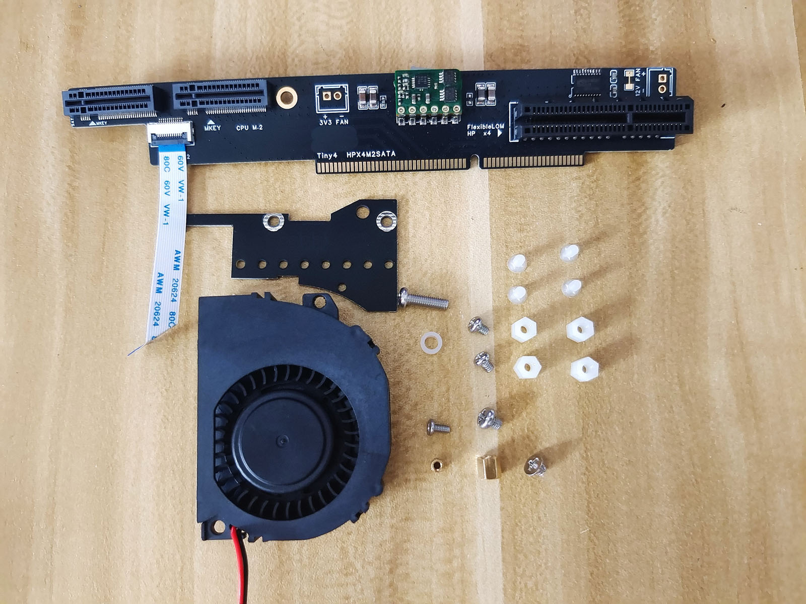
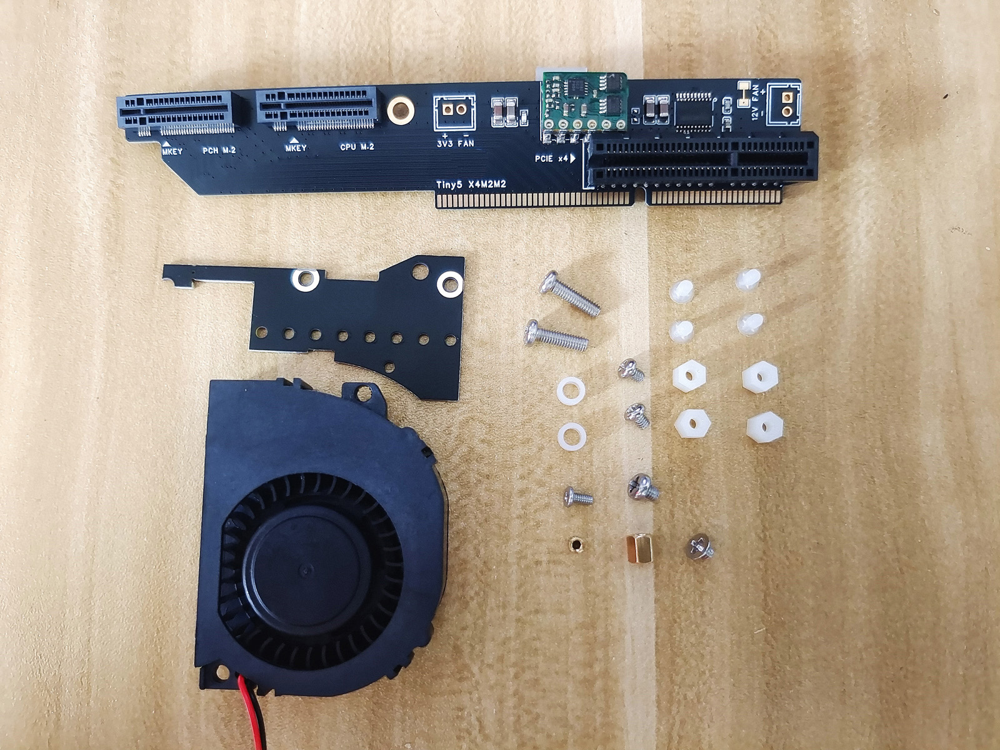
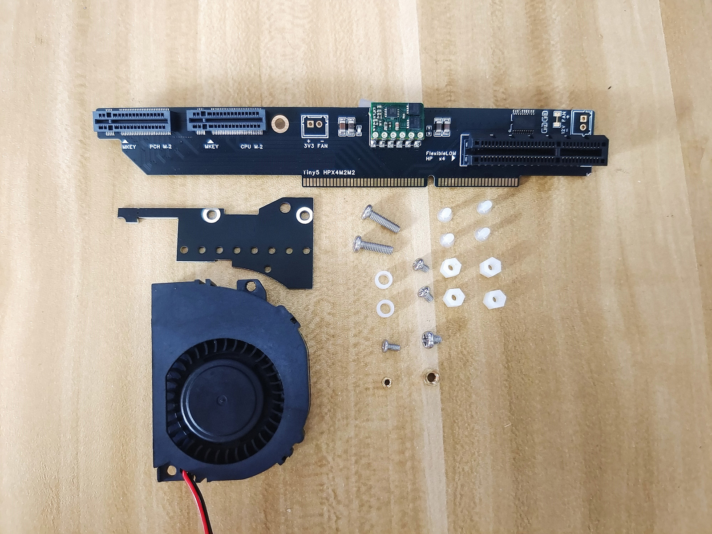
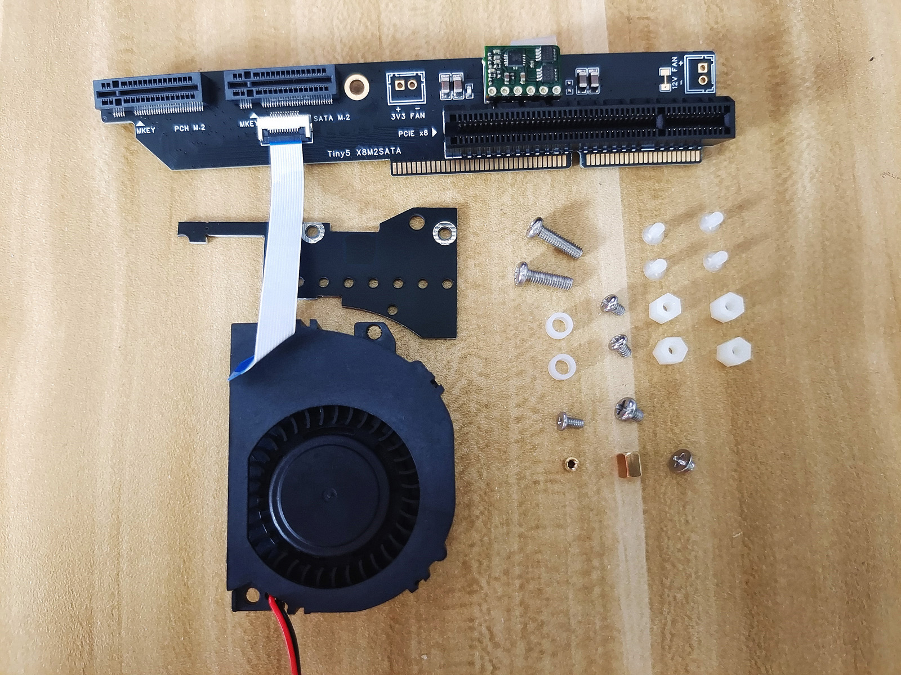
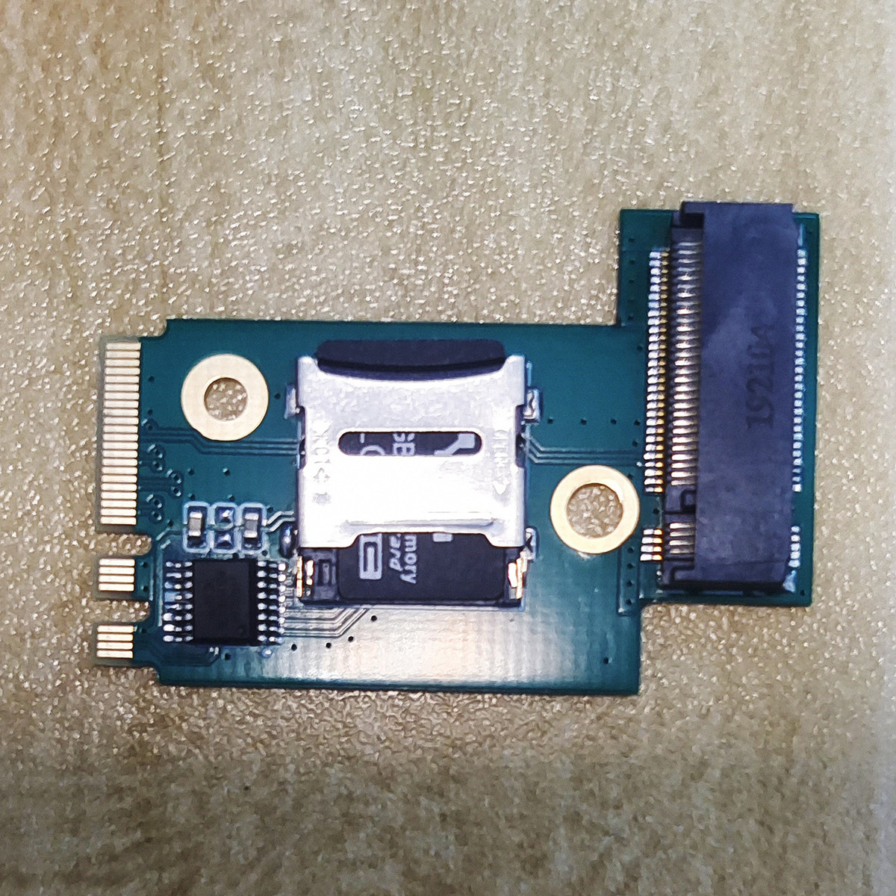
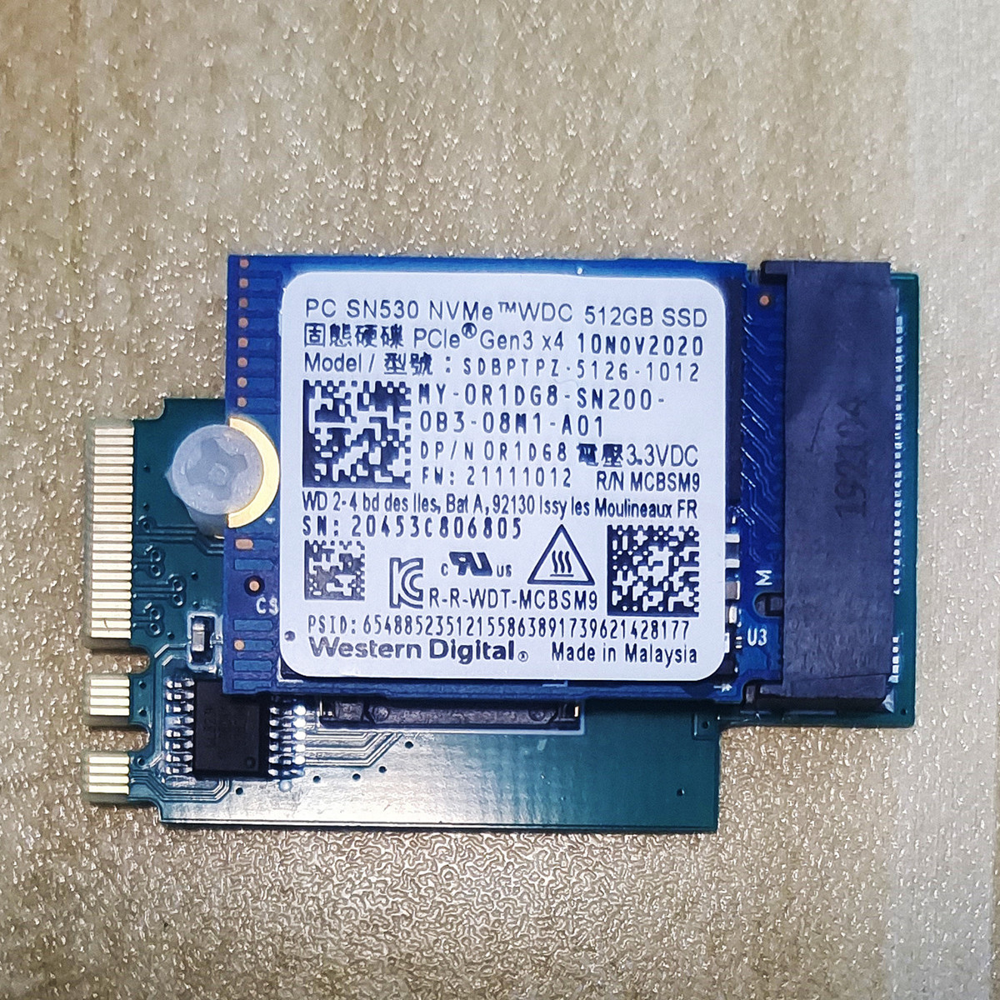

# Lenovo Tiny Serial PCIE Expansion Card

联想小主机，Tiny4和Tiny5系列使用的PCIE扩展卡。

最高可以扩展到6盘全闪NAS+万兆网卡，非常适合作为NAS使用。

**注意：除了Tiny5-X8M2SATA以外其他型号都需要硬改主板的拆分电阻才行！！！**

安装教程: [安装教程](./picture/M910-M920拆分卡使用教程.pdf)

## PCIE 拆分卡 图片：

### Tiny4-X4M2SATA

适用机型： M910Q M910X P320

***\*M710无法使用***

可以扩展出：

    1个 PCIE3.0x4 标准插槽
    1个 PCIE3.0x4 M.2插槽(NVME)
    1个 SATA协议  M.2插槽(SATA)

**注意1：需要硬改主板拆分配置电阻才可以**

**注意2：拆分卡SATA接口是通过排线将主板的SATA口引过来的**

购买地址： [https://item.taobao.com/item.htm?id=836456384198&skuId=5596555241763](https://item.taobao.com/item.htm?id=836456384198&skuId=5596555241763)

___

### Tiny4-HPX4M2SATA

适用机型： M910Q M910X P320

***\*M710无法使用***

可以扩展出：

    1个 PCIE3.0x4 HP FLR系列网卡专用插槽
    1个 PCIE3.0x4 M.2插槽(NVME)
    1个 SATA协议  M.2插槽(SATA)

**注意1：需要硬改主板拆分配置电阻才可以**

**注意2：拆分卡SATA接口是通过排线将主板的SATA口引过来的**

购买地址： [https://item.taobao.com/item.htm?id=836456384198&skuId=5596555241765](https://item.taobao.com/item.htm?id=836456384198&skuId=5596555241765)

___

### Tiny5-X4M2M2

适用机型： M920Q M920X P320

***\*M720无法使用***

可以扩展出：

    1个 PCIE3.0x4 标准插槽
    2个 PCIE3.0x4 M.2插槽(NVME)

**注意1：需要硬改主板拆分配置电阻才可以**

购买地址： [https://item.taobao.com/item.htm?id=836456384198&skuId=5596555241767](https://item.taobao.com/item.htm?id=836456384198&skuId=5596555241767)

___

### Tiny5-HPX4M2M2

适用机型： M920Q M920X P320

***\*M720无法使用***

可以扩展出：

    1个 PCIE3.0x4 HP FLR系列网卡专用插槽
    2个 PCIE3.0x4 M.2插槽(NVME)

**注意1：需要硬改主板拆分配置电阻才可以**

购买地址： [https://item.taobao.com/item.htm?id=836456384198&skuId=5596555241769](https://item.taobao.com/item.htm?id=836456384198&skuId=5596555241769)

___

### Tiny5-X8M2SATA

适用机型： M920Q M920X P320

***\*M720也许无法使用，未测试***

可以扩展出：

    1个 PCIE3.0x8 标准插槽
    1个 PCIE3.0x4 M.2插槽(NVME)
    1个 SATA协议  M.2插槽(SATA)

**注意1：不需要主板拆分**

**注意2：拆分卡SATA接口是通过排线将主板的SATA口引过来的**

购买地址： [https://item.taobao.com/item.htm?id=836456384198&skuId=5596555241771](https://item.taobao.com/item.htm?id=836456384198&skuId=5596555241771)

___

### WLAN转TF卡+M.2硬盘

此位置之前是放置WIFI网卡的，可以扩展为1个TF卡槽+1个M.2硬盘位。

___

## 装机后的照片：

