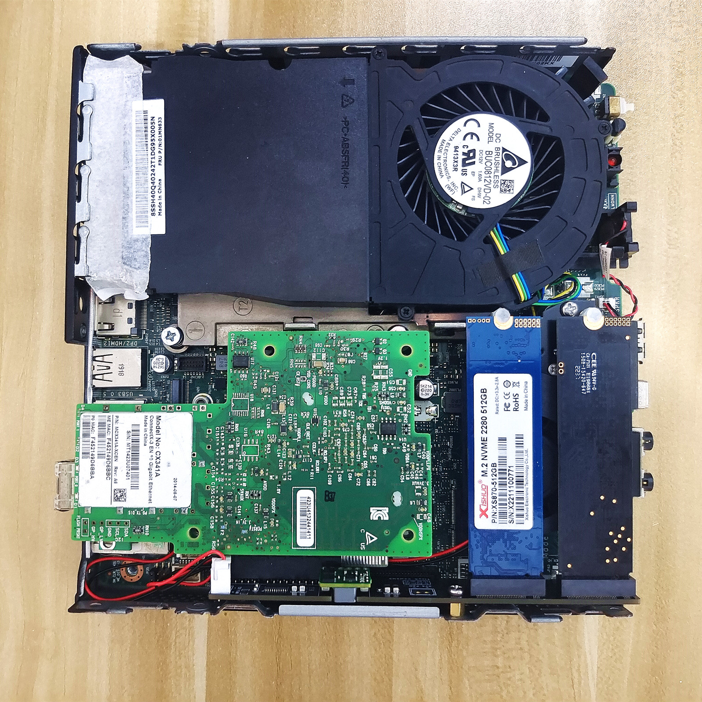

# Lenovo Tiny Serial PCIE Expansion Card

[中文文档](./README-ZH.md)

The PCIE expansion card used in Lenovo small consoles, Tiny4 and Tiny5 series.

It can be expanded up to 6 full flash NAS drives and 10 Gigabit Ethernet cards, making it very suitable for use as a NAS.

**Attention: Except for Tiny5-X8M2SATA, all other models require hard modification of the motherboard's PCIE bifurcation resistor**

Installation Tutorial: [Installation Tutorial](./picture/M910-M920拆分卡使用教程.mht)

## PCIE bifurcation card Image:

### Tiny4-X4M2SATA

Applicable models: M910Q M910X P320

***\*M710 unavailable***

It can be extended to:

    1* PCIE3.0x4 Standard slot
    1* PCIE3.0x4 M.2 slots(NVME)
    1* SATA protocol  M.2 slots(SATA)

**warning1: We need to modify the configuration resistors on the motherboard to achieve PCIe bifurcation**

**warning2: The SATA interface on the expansion card is connected to the motherboard's SATA port through a ribbon cable**

Purchase address: [https://item.taobao.com/item.htm?id=836456384198&skuId=5596555241763](https://item.taobao.com/item.htm?id=836456384198&skuId=5596555241763)

___

### Tiny4-HPX4M2SATA

Applicable models: M910Q M910X P320

***\*M710 unavailable***

It can be extended to:

    1* PCIE3.0x4 HP FLR series network card dedicated slot
    1* PCIE3.0x4 M.2 slots(NVME)
    1* SATA protocol  M.2 slots(SATA)

**warning1: We need to modify the configuration resistors on the motherboard to achieve PCIe bifurcation**

**warning2: The SATA interface on the expansion card is connected to the motherboard's SATA port through a ribbon cable**

Purchase address: [https://item.taobao.com/item.htm?id=836456384198&skuId=5596555241765](https://item.taobao.com/item.htm?id=836456384198&skuId=5596555241765)

___

### Tiny5-X4M2M2

Applicable models: M920Q M920X P320

***\*M720 unavailable***

It can be extended to:

    1* PCIE3.0x4 Standard slot
    2* PCIE3.0x4 M.2 slots(NVME)

**warning1: We need to modify the configuration resistors on the motherboard to achieve PCIe bifurcation**

Purchase address: [https://item.taobao.com/item.htm?id=836456384198&skuId=5596555241767](https://item.taobao.com/item.htm?id=836456384198&skuId=5596555241767)

___

### Tiny5-HPX4M2M2

Applicable models: M920Q M920X P320

***\*M720 unavailable***

It can be extended to:

    1* PCIE3.0x4 HP FLR series network card dedicated slot
    2* PCIE3.0x4 M.2 slots(NVME)

**warning1: We need to modify the configuration resistors on the motherboard to achieve PCIe bifurcation**

Purchase address: [https://item.taobao.com/item.htm?id=836456384198&skuId=5596555241769](https://item.taobao.com/item.htm?id=836456384198&skuId=5596555241769)

___

### Tiny5-X8M2SATA

Applicable models: M920Q M920X P320

***\*M720 may not be usable, untested***

It can be extended to:

    1* PCIE3.0x8 Standard slot
    1* PCIE3.0x4 M.2 slots(NVME)
    1* SATA protocol  M.2 slots(SATA)

**warning1: No need to PCIe bifurcation the motherboard**

**warning2: The SATA interface on the expansion card is connected to the motherboard's SATA port through a ribbon cable**

Purchase address: [https://item.taobao.com/item.htm?id=836456384198&skuId=5596555241771](https://item.taobao.com/item.htm?id=836456384198&skuId=5596555241771)

___

### WLAN to TF card + M.2 slot

This location was previously used for placing WIFI network cards, which can be expanded to 1 TF card slot and 1 M.2 hard drive slot.

___

## Photos taken after installation:

